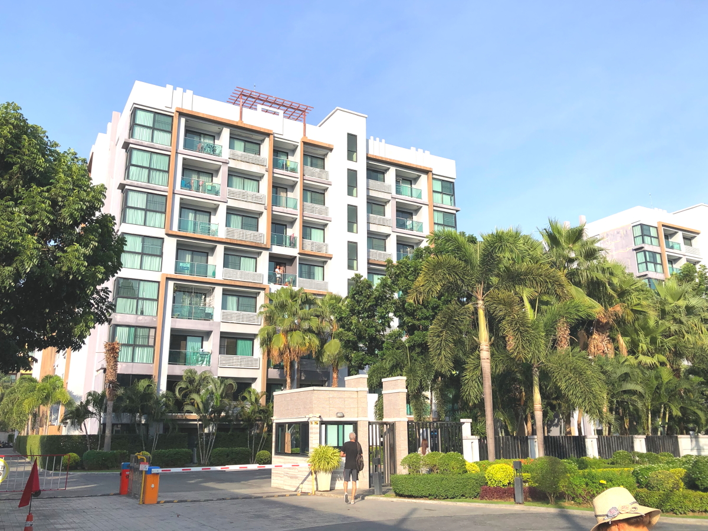

# 2024Jan_Thailand_2

<html>
<head>

<meta charset="UTF-8">
<meta http-equiv="Content-Type" content="text/html; charset=UTF-8">
<meta http-equiv="X-UA-Compatible" content="IE=EmulateIE10" />
<meta http-equiv="X-UA-Compatible" content="IE=edge">

<!--ここから上はお決まりの定型文です-->

<!--ここからが表現の書式などを決めるcssという部分-->

<link href="https://cdnjs.cloudflare.com/ajax/libs/lightbox2/2.7.1/css/lightbox.css" rel="stylesheet">

</head>

<body>

モバイル端末をお使いの場合は、画面を横向きにすると
より見やすくご覧頂けます。

<!--ここ上は、ほぼそのまま使います！-->

<!--QRコードの挿入例-->

 アクセス用QRコード

<marquee direction="left" scrollamount="20" width="30%">(^_^)/~hada</marquee>

<!--流れ文字の挿入例-->
<h1><marquee behavior="left">!!! 2024/01/02 、バンコク~パタヤ往復 !!!</marquee></h1>

<a href="https://torokoid.github.io/2024Jan_Thailand/">Thailand</a>>Thailand_2>><a href="https://torokoid.github.io/2024Jan_Thailand_3/">Thailand_3</a>

                 

<!--ここから下が、本体部分-->
 
タイ旅行

  
以下写真集！

1月2日はバンコクからパタヤまでお出かけしました。

出発前の食事はセブンイレブン。

タイのセブンイレブン値段感覚、バーツの値札 x 4倍で日本円です。

セブンイレブンの前は池ですが、ハスの花が咲きそうです。

ちなみにセブンイレブン買い物すると、IDカードフォルダが漏れなくもらえました。

高速道路の看板は目的地までの所要時間（分）ですが、全く読めません。

前のトラック、タイヤがはみ出てますが、合法です。

リゾートマンションにお邪魔して、プールをお借りします。

プールの中は完全に欧米、おそらくロシア人がほとんどと思われます。 東洋人は一人だけ確認できました。

お昼はマックで軽く済ませます。

お値段はあまり軽くありませんね〜249バーツ ≒ 約1000円。

帰りの高速道路から見えた夕陽が綺麗でした。

お正月はタイの高速道路は無料開放されてました。 料金所通過時に緑の文字でFreeと見えます・・・見えないか？

<iframe width="560" height="315" src="https://www.youtube.com/embed/eJzk80w6Uzc?si=v-YCtNul0yarkRQX" title="YouTube video player" frameborder="0" allow="accelerometer; autoplay; clipboard-write; encrypted-media; gyroscope; picture-in-picture; web-share" allowfullscreen></iframe>

ちなみにタイの守衛所の散らかり具合・・・どこもこんな感じ。

若い守衛さんたちはスマホいじりに専念中。

最後に今年のカレンダーですが、仏暦2567年、 西暦は2024年ですね〜ブッダがキリストより543歳年上なのです。

  

      

<!--本体はここまで-->

<!--画面に空白地帯を作って、背景が見えるようにしています-->
                                              

<!-- フッタ -->
<footer>

Copyright 2024/01/02 S.Hada

</footer>

<!--HPにさまざまなJavaScriptを呼び込むための書式-->

